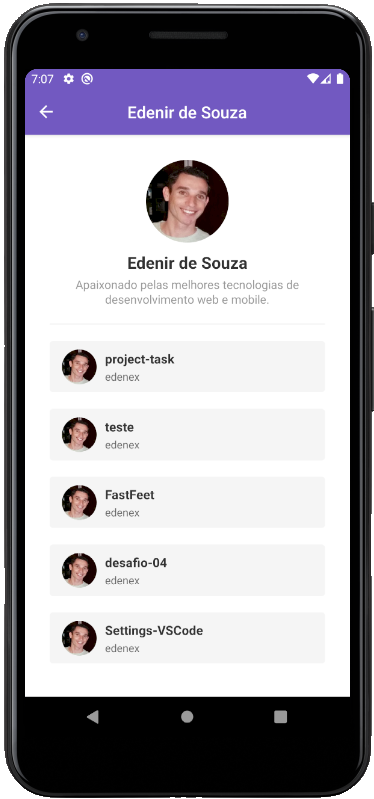
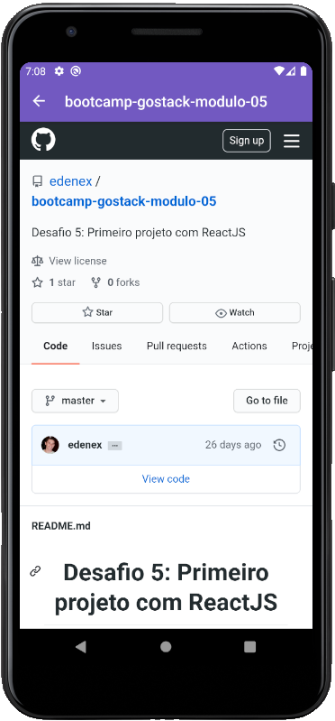

<h1 align="center">
Desafio 6: Primeiro projeto com React-Native
</h1>

## :information_source: Sobre o projeto

App mobile para adicionar usuários do Github via API e poder visualizar os projetos que o usuário possui como favoritos (starred).

O projeto apresenta basicamente 3 telas (screens):

### Main:

#### Nesta tela é possível procurar um usuário no Github, sempre pelo login.

### User:

#### Nesta tela é possível visualizar os projetos favoritados (starred) de usuário do Github, após clicar no botão "Ver Perfil" da tela Main.

### Repository:

#### Nesta tela é possível visualizar os detalhes do projeto do usuário.

## :black_nib: Funcionalidades

1. É possível adicionar um usuário do Github.
2. A aplicação busca o usuário por meio de uma API.
3. Uma vez adicionado um usuário ele ficará armazenado na memória interna do dispositivo móvel por meio do recurso AsyncStorage.
4. É possível acessar os projetos favoritos do usuário (starred) clicando no botão "Ver Perfil".
5. Na tela User é possível visualizar a lista de projetos que o usuário adicionou em seu perfil como favoritos (starred).
6. Após clicar sobre um determinado projeto é possível visualizar todos os detalhes do projeto. Esta tela (Repository) utiliza um recurso do React-Native chamado WebView.

## :rocket: Tecnologias

As principais tecnologias/bibliotecas utilizadas são:

- Axios
- PropTypes
- Async Storage: @react-native-community/async-storage
- react-native-gesture-handler
- Icons: react-native-vector-icons
- WebView: react-native-webview
- styled-components
- slint + Prettier + Babel

## :construction_worker: Como utilizar

Basta clonar o projeto utilizando o comando abaixo:

git clone https://github.com/edenex/bootcamp-gostack-modulo-06.git

## :memo: Licença

Esse projeto está sob a licença MIT. Veja o arquivo [LICENSE](LICENSE.md) para mais detalhes.

---

Feito com 🧡 by [Edenir de Souza](https://github.com/edenex) 😉
